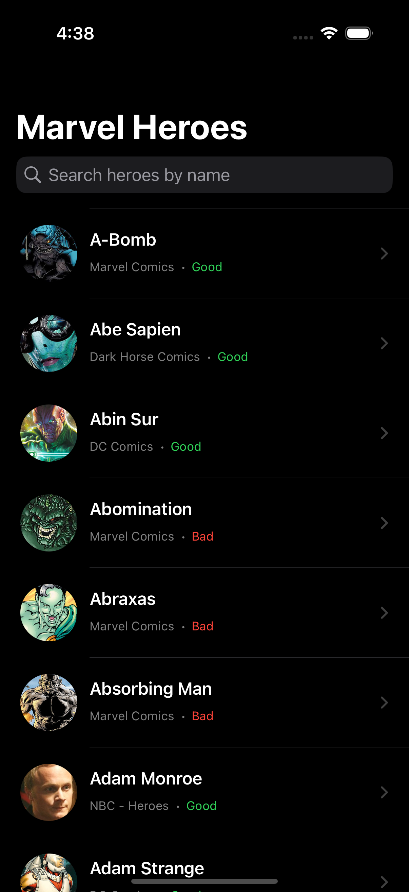
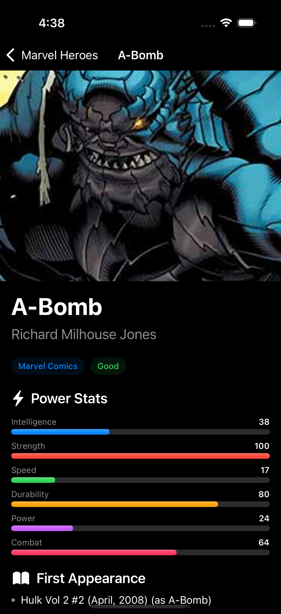
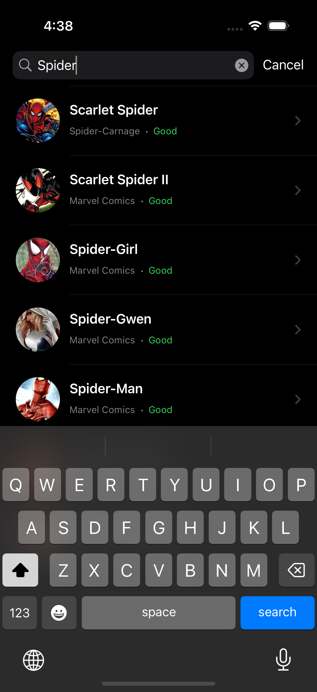
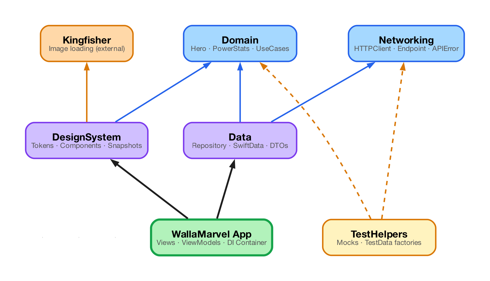

# WallaMarvel

A superhero browsing app built for Wallapop's iOS Tech Test. The app fetches heroes with pagination, search, and rich detail screens including animated power stats.

## Screenshots

| Heroes List | Hero Detail | Search |
|:-:|:-:|:-:|
|  |  |  |

## API Choice

The original Marvel API was experiencing downtime (HTTP 500). As suggested in the task requirements, this implementation uses the **[Superhero API](https://akabab.github.io/superhero-api/)** - a free, open-source API hosted on GitHub Pages with 731 superheroes from Marvel, DC, and other publishers.

The clean architecture made this swap straightforward: only the `Data` module's API layer changed. Domain models, Use Cases, ViewModels, and Views were adapted to the new data shape but the overall architecture remained intact.

**Key difference**: The Superhero API returns all heroes in a single response. The repository fetches once and caches both in memory (actor-isolated cache) and persistently (SwiftData), then serves paginated pages and filtered search results client-side.

## Architecture

### Module Dependency Graph



Solid arrows = compile dependencies. Dashed arrows = test/optional dependencies. Arrows point from consumer to dependency.

### Architecture Strengths

**Compile-time layer enforcement** — Module boundaries are enforced by Swift Package Manager. A View cannot accidentally import a repository implementation, and the Domain layer literally *cannot* import UIKit or networking code. Violations fail the build, not a code review.

**Proven API-swap resilience** — The original Marvel API went down (HTTP 500). Swapping to the Superhero API required changes *only* in the `Data` module — new DTOs, a new endpoint enum, and an updated mapper. The Domain layer (models, protocols, use cases), all ViewModels, and every SwiftUI view compiled and ran without modification. This is the dependency rule in practice, not theory.

**Offline-first with zero UI changes** — Adding SwiftData persistence required no changes to ViewModels or Views. The `HeroRepository` gained a `localDataSource` parameter; the composition root wires it. The rest of the app is unaware that persistence exists — it just sees `HeroRepositoryProtocol`.

**Independent module testing** — Each SPM module runs its own test suite via `swift test` with no simulator, no Xcode project, and no app host. The `Data` module's 22 tests execute in <1 second. This enables fast CI feedback and parallel test jobs.

**Snapshot-tested design system** — Every reusable UI component (HeroRowView, PowerStatsView, ErrorStateView, DetailSectionView) has snapshot tests with deterministic rendering. Design regressions are caught automatically — no manual visual QA needed for component changes.

**Thread safety by design** — The in-memory hero cache is a Swift `actor`, guaranteeing exclusive access without manual locking. ViewModels are `@MainActor`-annotated, ensuring all `@Published` mutations happen on the main thread. The codebase compiles cleanly with `SWIFT_STRICT_CONCURRENCY = targeted`.

### SPM Modules

The app is split into **5 independent Swift packages** under `Modules/`, enforcing layer boundaries at compile time:

| Module | Responsibility | Dependencies |
|--------|---------------|-------------|
| **Networking** | Generic HTTP client, endpoint protocol, typed API errors | None (pure Foundation) |
| **Domain** | Hero, PowerStats, HeroesPage models, repository protocols, use cases | None (pure Swift) |
| **Data** | Repository implementation, remote data source, DTO mappers, Superhero API endpoints, SwiftData persistence | Networking, Domain |
| **DesignSystem** | Design tokens (colors, typography, spacing, sizes), reusable UI components (HeroRowView, PowerStatsView, ErrorStateView, DetailSectionView), snapshot tests | Domain, Kingfisher |
| **TestHelpers** | Shared mocks (MockHeroRepository) and test data factories | Domain, Networking |

```
WallaMarvel-2/
├── Modules/
│   ├── Networking/        # HTTPClient, Endpoint, APIError
│   ├── Domain/            # Hero, PowerStats, HeroesPage, protocols, use cases
│   ├── Data/              # Repository, data sources, mappers, DTOs, SwiftData persistence
│   ├── DesignSystem/      # Design tokens, reusable components, snapshot tests
│   └── TestHelpers/       # Mocks, test data factories
├── WallaMarvel/           # App entry point, views, view models, transition modifiers
│   ├── App/               # WallaMarvelApp, RootView, DependencyContainer
│   └── Presentation/      # HeroesListView, HeroDetailView, ViewModels
├── WallaMarvelTests/      # ViewModel unit tests
├── WallaMarvelUITests/    # End-to-end UI tests
├── project.yml            # XcodeGen configuration
├── Makefile               # Developer commands
└── .swiftlint.yml         # Linting rules
```

### Key Design Decisions

| Decision | Rationale |
|---|---|
| **SPM modularization** | Enforces layer boundaries at compile time. Modules build and test independently. No circular dependencies possible. |
| **SwiftUI** over UIKit | Modern declarative UI with less boilerplate. NavigationStack for type-safe navigation. |
| **SwiftData persistence** | Offline-first: cached heroes survive app restarts. In-memory actor cache for session performance, SwiftData for durable storage. |
| **DesignSystem module** | Centralized design tokens prevent hardcoded values. Components are reusable and snapshot-tested. |
| **Snapshot testing** | Visual regression testing for all reusable UI components using swift-snapshot-testing. Deterministic rendering environment. |
| **async/await** | Structured concurrency is cleaner, eliminates callback hell, and integrates naturally with SwiftUI's `.task` modifier. |
| **Actor-based cache** | `HeroCache` is an actor ensuring thread-safe access to the in-memory hero store from concurrent async calls. |
| **Client-side pagination** | The API returns all heroes at once. The repository caches and serves paginated slices - instant page loads after initial fetch. |
| **iOS 18 zoom transition** | `matchedTransitionSource` / `navigationTransition(.zoom)` for hero image morphing, with graceful `#available` fallback. |
| **Protocol-oriented DI** | Constructor injection via protocols. `DependencyContainer` is the composition root - no third-party DI framework needed. |
| **XcodeGen** | Eliminates merge conflicts in `.xcodeproj` and makes project configuration declarative via `project.yml`. |
| **Separate DTO and Domain models** | DTOs mirror the API response; domain models are shaped for the app. `HeroMapper` decouples the app from API changes. |

## Features Implemented

### Must-have
- **Hero Detail Screen**: Tapping a hero navigates to a detail screen showing name, full name, publisher/alignment badges, animated power stats bars, first appearance, aliases, and group affiliations.
- **Pagination**: Infinite scroll - when the user reaches the last item, the next page loads automatically. Pagination state is tracked in the ViewModel.

### Nice-to-have
- **Offline Support**: Heroes are persisted to SwiftData on first fetch. On subsequent launches, cached data is shown immediately while a background refresh occurs.
- **Search Bar**: Built-in `.searchable` modifier with debounced filtering. Client-side case-insensitive name search across 731 heroes.
- **Structured Concurrency**: Full async/await throughout. Actor-isolated cache for thread safety.
- **SwiftUI**: Entire UI built with SwiftUI - NavigationStack, List, ScrollView, and custom animated stat bars.
- **Accessibility**: Accessibility identifiers, labels, hints, and traits. Screen reader support with `.accessibilityElement(children:)`, `.accessibilityAddTraits(.isHeader)`, `.accessibilityHidden(true)` for decorative images.
- **Animations**: See below.

## Animations

Three layers of interactive animation enhance the user experience:

| Animation | Description | iOS Requirement |
|---|---|---|
| **Zoom transition** | Hero cell morphs into the detail screen via `matchedTransitionSource` and `navigationTransition(.zoom)`. `RootView` owns the `@Namespace` shared between list and detail. | iOS 18+ (graceful fallback) |
| **Staggered sections** | Detail screen sections (name, badges, stats, aliases, affiliations) slide up and fade in sequentially with spring physics and 80ms stagger. | iOS 17+ |
| **Power stats bars** | All 6 stat bars animate from zero width to actual value with staggered spring animations (60ms between bars, 0.8s spring response). | iOS 17+ |

## Testing Strategy

### Module Tests (SPM)

| Module | Test Count | What's tested |
|---|---|---|
| **Data** — `HeroRepositoryTests` | 10 | Client-side pagination, caching, search filtering, error propagation, offline-first persistence |
| **Data** — `HeroMapperTests` | 5 | DTO-to-domain mapping, power stats, image URLs, alias filtering |
| **Data** — `SuperheroEndpointTests` | 4 | URL construction, path correctness, base URL, query items |
| **Data** — `HeroEntityMapperTests` | 3 | SwiftData entity round-trip mapping, sort index, nil aliases handling |
| **Domain** — `DomainTests` | 2 | HeroesPage.hasMore computed property |
| **DesignSystem** — Snapshot tests | 11 | Visual regression for HeroRowView (4), PowerStatsView (3), ErrorStateView (2), DetailSectionView (2) |

### App Unit Tests — 14 tests

| Test Suite | Count | What's tested |
|---|---|---|
| `HeroesListViewModelTests` | 9 | Initial load, pagination, error states, retry, idempotent loading, hasMorePages |
| `HeroDetailViewModelTests` | 5 | Load, error handling, retry, idempotent loading |

### UI Tests — 11 tests + 2 launch tests

| Test | What it verifies |
|---|---|
| `test_heroesList_showsNavigationTitle` | "Marvel Heroes" title appears on launch |
| `test_heroesList_showsSearchBar` | Search bar with placeholder text is visible |
| `test_heroesList_displaysHeroes` | Heroes load from the API and first hero is visible |
| `test_heroesList_showsPublisherInfo` | Publisher info appears in list rows |
| `test_tappingHero_navigatesToDetail` | Tapping a hero navigates to its detail screen |
| `test_heroDetail_showsPowerStats` | Detail screen shows "Power Stats" section |
| `test_heroDetail_showsStatLabels` | Intelligence, Strength, Speed labels are present |
| `test_heroDetail_backButtonReturnsToList` | Back button returns to the heroes list |
| `test_search_filtersHeroesByName` | Typing "Batman" filters the list |
| `test_search_showsEmptyStateForNoResults` | Gibberish search shows "No heroes found" |
| `test_scrollingDown_showsMoreHeroes` | Scrolling down loads additional hero pages |
| `test_launch_showsMainScreen` | App launches to the Marvel Heroes screen |
| `test_launchPerformance` | Measures app launch time |

### Running Tests

```bash
# All module tests (SPM - fast, no simulator needed)
make test-modules

# App unit tests (requires simulator)
make test-unit

# UI tests (requires simulator)
make test-ui

# Everything
make test

# Record snapshot reference images (first run or after intentional UI changes)
make record-snapshots
```

## Development Infrastructure

### Build System

| Feature | Detail |
|---|---|
| **XcodeGen** | Project generated from declarative `project.yml` - no `.xcodeproj` merge conflicts |
| **SPM modularization** | 5 independent packages with compile-time boundary enforcement |
| **Strict concurrency** | `SWIFT_STRICT_CONCURRENCY = targeted` for Swift 6 readiness |
| **Warnings as errors** | `SWIFT_TREAT_WARNINGS_AS_ERRORS = YES` in Release builds |
| **Code coverage** | Enabled in Debug for unit test coverage reporting |
| **Dead code stripping** | `DEAD_CODE_STRIPPING = YES` for smaller binaries |

### CI/CD - GitHub Actions

The `.github/workflows/ci.yml` pipeline runs on every PR and push to `main`:

```
lint (SwiftLint) ──┐
                   ├──> build-and-test (Build → Unit Tests → UI Tests)
test-modules ──────┘
  ├── Networking
  ├── Domain
  ├── Data
  └── DesignSystem
```

- **Concurrency**: Cancels in-progress runs for the same branch
- **Caching**: SPM packages cached between runs
- **Artifacts**: `.xcresult` bundles uploaded for test failure triage

### Quality Assurance - SwiftLint

**0 violations** across all source files. Configuration in `.swiftlint.yml`:

- 30+ rules enabled including `closure_spacing`, `empty_count`, `first_where`, `modifier_order`, `sorted_first_last`, `toggle_bool`
- Lints all `Modules/` source code in addition to the main app
- Line length: 140 warning / 200 error
- Integrated as a **pre-build script** in Xcode

### Makefile

```bash
make build             # Generate project + build
make test              # Run all tests (modules + unit + UI)
make test-modules      # Run SPM module tests only
make test-unit         # Run unit tests only
make test-ui           # Run UI tests only
make record-snapshots  # Record DesignSystem snapshot reference images
make lint              # Run SwiftLint analysis
make lint-fix          # Auto-fix SwiftLint violations
make clean             # Clean build artifacts
make help              # Show all available targets
```

## Improvements Over Original Code

| Original Issue | Fix |
|---|---|
| `try!` force unwrapping in APIClient | Typed `APIError` enum with user-facing messages |
| Completion handler API | Full async/await with structured concurrency |
| UITableView with MVP | SwiftUI with MVVM |
| No detail screen | Rich detail: power stats, publisher, aliases, affiliations |
| No pagination | Infinite scroll with client-side page tracking |
| No search | Debounced client-side search by name |
| No tests (empty templates) | 35+ module tests + 14 unit + 13 UI = **60+ tests** |
| No error handling UI | `ErrorStateView` with retry |
| Cell tap → infinite VC loop | NavigationStack with `.navigationDestination` |
| No animations | iOS 18 zoom transition, staggered sections, animated stat bars |
| No accessibility | Identifiers, labels, hints, traits throughout |
| No offline support | SwiftData persistence for offline-first experience |
| Monolithic single target | 5 SPM modules with compile-time boundary enforcement |
| Hardcoded colors/spacing | DesignSystem module with semantic design tokens |
| No visual regression tests | Snapshot testing for all reusable UI components |
| Manual .xcodeproj | XcodeGen with declarative `project.yml` |
| No CI/CD | GitHub Actions: lint → module tests → build → unit tests → UI tests |
| No linting | SwiftLint with 30+ rules, 0 violations |
| Marvel API down (500) | Switched to reliable Superhero API (GitHub Pages) |

## Build & Run

**Requirements:** Xcode 16+, iOS 17+ simulator

```bash
# Quick start (requires xcodegen and swiftlint: brew install xcodegen swiftlint)
make build

# Or manually:
xcodegen generate
xcodebuild -project WallaMarvel.xcodeproj -scheme WallaMarvel build

# Run all tests
make test

# Lint
make lint
```

Or open `WallaMarvel.xcodeproj` in Xcode and run.

## Dependencies

| Dependency | Purpose |
|---|---|
| [Kingfisher](https://github.com/onevcat/Kingfisher) 8.x | Async image downloading and caching with SwiftUI integration |

**Dev/test dependencies** (resolved by SPM within modules):

| Tool | Purpose |
|---|---|
| [swift-snapshot-testing](https://github.com/pointfreeco/swift-snapshot-testing) 1.18+ | Visual regression testing for DesignSystem components |

**Dev tools** (not bundled, installed via Homebrew):

| Tool | Purpose |
|---|---|
| [XcodeGen](https://github.com/yonaskolb/XcodeGen) | Generate `.xcodeproj` from `project.yml` |
| [SwiftLint](https://github.com/realm/SwiftLint) | Static analysis and style enforcement |

## Security Considerations

| Measure | Detail |
|---|---|
| **TLS 1.2 minimum** | `URLSessionConfiguration.tlsMinimumSupportedProtocolVersion = .TLSv12` prevents protocol downgrade attacks |
| **No network disk caching** | `urlCache = nil` and `.reloadIgnoringLocalCacheData` prevent sensitive API responses from being written to the URL cache |
| **SwiftData local storage** | Hero data is stored locally via SwiftData for offline support. Data at rest uses iOS default file protection. |
| **HTTPS only** | All API endpoints use HTTPS |
| **No hardcoded secrets** | The Superhero API requires no API keys |
| **Input validation** | HTTP status codes validated (200-299 range). Decoding errors caught and wrapped in typed errors |
| **Actor isolation** | `HeroCache` uses a Swift actor to prevent data races in concurrent access |

## SOLID Principles Applied

- **S** - Single Responsibility: Each module has one clear purpose. Each class/struct has one job.
- **O** - Open/Closed: New endpoints extend `SuperheroEndpoint` without modifying existing code. New data sources implement `HeroRemoteDataSourceProtocol`.
- **L** - Liskov Substitution: All mocks are drop-in replacements for their protocols in tests.
- **I** - Interface Segregation: Focused protocols (`FetchHeroesUseCaseProtocol` vs `SearchHeroesUseCaseProtocol` vs `FetchHeroDetailUseCaseProtocol`).
- **D** - Dependency Inversion: Presentation depends on abstractions (protocols), not concrete implementations. The API swap proved this works in practice.
